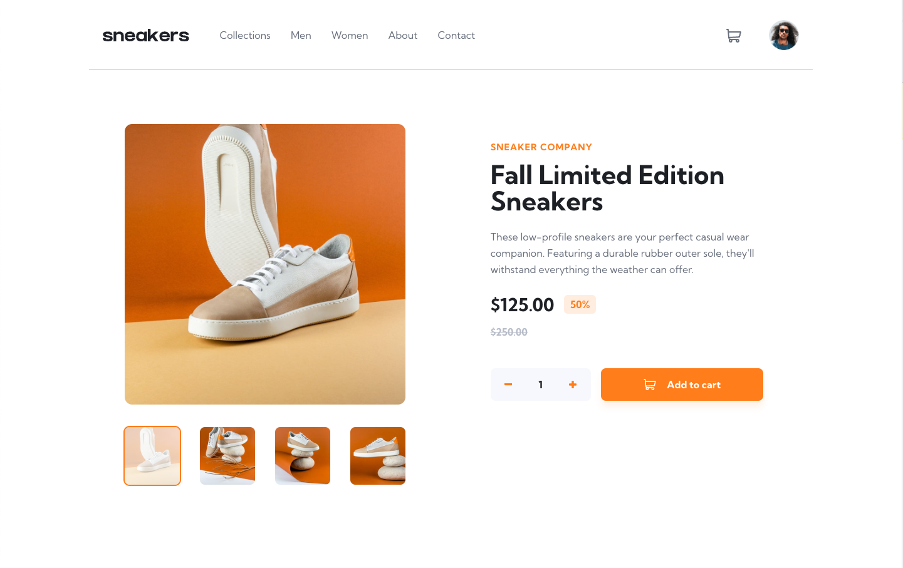
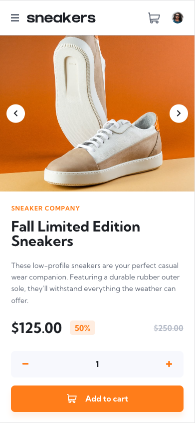

# Frontend Mentor - E-commerce product page

## Table of contents

- [Overview](#overview)
  - [The challenge](#the-challenge)
  - [Screenshot](#screenshot)
  - [Links](#links)
- [My process](#my-process)
  - [Built with](#built-with)
  - [What I implemented](#what-i-implemented)

## Overview

### The challenge

Users should be able to:

- [x] View the optimal layout for the site depending on their device's screen size
- [x] See hover states for all interactive elements on the page
- [x] Open a lightbox gallery by clicking on the large product image
- [x] Switch the large product image by clicking on the small thumbnail images
- [x] Add items to the cart
- [x] View the cart and remove items from it

### Screenshot

|                            Desktop                            |
| :-----------------------------------------------------------: |
|                                          |
|                          **Mobile**                           |
|  |

### Links

- Solution URL: [Github](https://github.com/rylanzhou/frontend-mentor-ecommerce-product-page)
- Live Site URL: [Vercel](https://frontend-mentor-ecommerce-product-page-woad.vercel.app/)

## My process

### Built with

- Semantic HTML5 markup
- Scss
- Mobile-first workflow
- [React](https://reactjs.org/) - JS library
- TypeScript
- Vite

### What I implemented

1. Use `ref` on `<Header>` component and `window.onresize` to determine the position of basket popup when in large screens.

2. Use `vite-plugin-svgr` lib to directly import SVGs as components. Remove the `fill` property in each SVG file beforehand so that the color can be adjusted with CSS.
